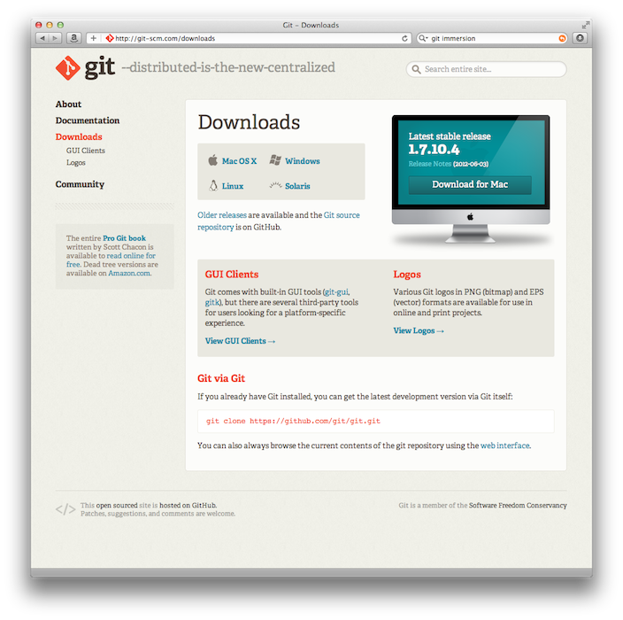

!SLIDE
# Git Out of Trouble

!SLIDE
## What is Git?

!SLIDE
## Environment

Mac OS X 10.7 "Lion"

1.7.10.4

command line

!SLIDE center
### git-scm.com/downloads

!SLIDE
# Trouble

!SLIDE center

!SLIDE
## Who gets into trouble?

!SLIDE center

!SLIDE center

!SLIDE center

!SLIDE center

!SLIDE center

!SLIDE
# An Ounce of Prevention

!SLIDE commandline
## RTFM

    $ git help <command>

    $ man git-<command>

!SLIDE commandline small

    $ git
    usage: git [--version] [--exec-path[=<path>]] [--html-path] [--man-path] [--info-path]
               [-p|--paginate|--no-pager] [--no-replace-objects] [--bare]
               [--git-dir=<path>] [--work-tree=<path>] [--namespace=<name>]
               [-c name=value] [--help]
               <command> [<args>]

    The most commonly used git commands are:
       add        Add file contents to the index
       bisect     Find by binary search the change that introduced a bug
       branch     List, create, or delete branches
       checkout   Checkout a branch or paths to the working tree
    ...

    See 'git help <command>' for more information on a specific command.

!SLIDE commandline incremental
## Experiment

    $ git add --dry-run .
    add '.gitignore'
    add '.rvmrc'
    add 'Gemfile'
    ...

    $ git status
      # On branch master
      #
      # Untracked files:
      #   (use "git add <file>..." to include in what will be committed)
      #
      #	.gitignore
      #	.rvmrc
      #	Gemfile
      ...

!SLIDE commandline incremental
## But, do wear safety goggles

`-n`, _usually_ short-hand for `--dry-run`

    $ git help commit
    ...
    -n, --no-verify
               This option bypasses the pre-commit and
               commit-msg hooks. See also githooks(5).
    ...
    --dry-run
               Do not create a commit, but show a list of paths
               that are to be committed, paths with local
               changes that will be left uncommitted and paths
               that are untracked.

!SLIDE
# A Pound of Cure

!SLIDE commandline incremental
# Problem
## You added a file by mistake

    $ git add showoff.json

    $ git status
      # On branch master
      # Changes to be committed:
      #   (use "git reset HEAD <file>..." to unstage)
      #
      #        new file:     showoff.json

!SLIDE commandline incremental
# Solution
## RTFC

    $ git status
      # On branch master
      # Changes to be committed:
      #   (use "git reset HEAD <file>..." to unstage)
      #
      #        new file:     showoff.json

!SLIDE commandline incremental

    $ git reset HEAD showoff.json

    $ git status
      # On branch master
      # Untracked files:
      #   (use "git add <file>..." to include in what will be committed)
      #
      #        showoff.json

!SLIDE commandline incremental
# Problem
## You removed a file by mistake

    $ git rm references/02_slide.md
    rm 'references/02_slide.md'

    $ git status
     # On branch master
     # Changes to be committed:
     #   (use "git reset HEAD <file>..." to unstage)
     #
     #	deleted:    references/02_slide.md
     #

!SLIDE commandline incremental
# Solution
## RTFC

    $ git status
     # On branch master
     # Changes to be committed:
     #   (use "git reset HEAD <file>..." to unstage)
     #
     #	deleted:    references/02_slide.md
     #

!SLIDE commandline incremental small

    $ git reset HEAD references/02_slide.md
    Unstaged changes after reset:
    D	references/02_slide.md

    $ git status
     # On branch master
     # Changes not staged for commit:
     #   (use "git add/rm <file>..." to update what will be committed)
     #   (use "git checkout -- <file>..." to discard changes in working directory)
     #
     #	deleted:    references/02_slide.md
     #
     no changes added to commit (use "git add" and/or "git commit -a")

!SLIDE commandline incremental

    $ git checkout -- references/02_slide.md

    $ git status
     # On branch master
     nothing to commit (working directory clean)

!SLIDE commandline incremental smaller
# Problem
## Some file is cluttering up your status

    $ git status
      # On branch master
      # Untracked files:
      #   (use "git add <file>..." to include in what will be committed)
      #
      #	.DS_Store
      nothing added to commit but untracked files present (use "git add" to track)

!SLIDE commandline incremental smaller
## Ignore it!

    $ echo .DS_Store >> .gitignore

    $ cat .gitignore
    .DS_Store

    $ git status
      # On branch master
      # Untracked files:
      #   (use "git add <file>..." to include in what will be committed)
      #
      #	.gitignore
      nothing added to commit but untracked files present (use "git add" to track)

!SLIDE commandline incremental smaller
# Problem
## You want to ignore a file without updating all repositories

    $ git status
      # On branch master
      # Untracked files:
      #   (use "git add <file>..." to include in what will be committed)
      #
      #	.DS_Store
      nothing added to commit but untracked files present (use "git add" to track)

!SLIDE commandline incremental small
## Use a global ignore file

    $ git config --global core.excludesfile ~/.gitignore

    $ cat ~/.gitconfig
    ...
    [core]
            excludesfile = ~/.gitignore

    $ echo .DS_Store >> ~/.gitignore

    $ cat ~/.gitignore
    .DS_Store

    $ cat .gitignore

    $ git status
      # On branch master
      nothing to commit (working directory clean)

!SLIDE
# Problem
## `.DS_Store` is everywhere!

!SLIDE commandline
## You could...

    $ find . -type f -name ".DS_Store" -print | xargs rm -rf

    $ find . -type d -name ".svn" -print | xargs rm -rf

!SLIDE center

!SLIDE commandline

    $ git clean

    $ git clean -d

!SLIDE commandline incremental
# Problem
## You wrote a bad commit message for the last commit

    $ git commit -m "Whatever"
    [master 1eaaace] Whatever
     1 file changed, 11 insertions(+)

!SLIDE commandline incremental
# Solution
## Amend the last commit

    $ git commit --amend

!SLIDE code smaller

    Whatever

    # Please enter the commit message for your changes. Lines starting
    # with '#' will be ignored, and an empty message aborts the commit.
    # On branch master
    #
    # Changes to be committed:
    #   (use "git reset HEAD^1 <file>..." to unstage)
    #
    #	modified:   one/01_slide.md
    #

!SLIDE code smaller

    Describe amending commit to fix bad message

    # Please enter the commit message for your changes. Lines starting
    # with '#' will be ignored, and an empty message aborts the commit.
    # On branch master
    #
    # Changes to be committed:
    #   (use "git reset HEAD^1 <file>..." to unstage)
    #
    #	modified:   one/01_slide.md
    #

!SLIDE commandline
## Your bad log message is fixed

    $ git commit --amend
    [master a4f0c81] Describe amending commit to fix bad message
     1 file changed, 11 insertions(+)

!SLIDE center

!SLIDE commandline

    $ git commit -m "Whatever"
    [master 1eaaace] Whatever
     1 file changed, 11 insertions(+)

    $ git commit --amend
    [master a4f0c81] Describe amending commit to fix bad message
     1 file changed, 11 insertions(+)

!SLIDE commandline incremental
# Problem
## You wrote a bad commit message a few commits ago

    $ git commit -m "Whatever"
    [master 1eaaace] Whatever
     1 file changed, 11 insertions(+)

!SLIDE commandline incremental
# Solution
## Interactively rebase, stopping to correct bad message

    $ git rebase -i <sha>

!SLIDE commandline incremental
# Problem
## You want to clean up your local branches

    $ git branch
      546826_react_to_pgs_callback
      faster_specs
    * master
      pgs
      refactor_noaa_decline_reasons

!SLIDE commandline incremental
## Which branches can I delete?

    $ git branch
      546826_react_to_pgs_callback
      faster_specs
    * master
      pgs
      refactor_noaa_decline_reasons

    $ git branch --merged
      546826_react_to_pgs_callback
    * master
      pgs

!SLIDE commandline incremental
## Which branches should I keep?

    $ git branch
      546826_react_to_pgs_callback
      faster_specs
    * master
      pgs
      refactor_noaa_decline_reasons

    $ git branch --no-merged
      faster_specs
      refactor_noaa_decline_reasons

!SLIDE commandline incremental
## Which branches contain `<commit>`?

    $ git branch
      546826_react_to_pgs_callback
      faster_specs
    * master
      pgs
      refactor_noaa_decline_reasons

    $ git branch --contains
      faster_specs
    * master
      refactor_noaa_decline_reasons

!SLIDE bullets incremental
## Use `git branch`

* `--merged` to find all branches which can be safely deleted
* `--no-merged` to find branches which are candidates for merging into `HEAD`
* `--contains <commit>` find all branches which will need special attention if `<commit>` were to be rebased or amended

!SLIDE
## You want to know what changed in a commit

!SLIDE commandline incremental small

    $ git log -p

    commit 8fdd6b1a31ae4eb07ddafa7027c3e54cc4fdc9cc
    Author: Craig Demyanovich <cdemyanovich@gmail.com>
    Date:   Thu Jun 14 21:21:57 2012 -0500

        Bigger text on using an ignore file

    diff --git a/one/01_slide.md b/one/01_slide.md
    index a4a3fa7..b2cff87 100644
    --- a/one/01_slide.md
    +++ b/one/01_slide.md
    @@ -235,7 +235,7 @@ command line
           #        .DS_Store
           nothing added to commit but untracked files present (use "git add" to track)

    -!SLIDE commandline incremental smaller
    +!SLIDE commandline incremental small
     ## Use a global ignore file

         $ git config --global core.excludesfile ~/.gitignore

    commit 175c8c3bce2f2901f42ddc8c332b3d101ee2069a
    Author: Craig Demyanovich <cdemyanovich@gmail.com>
    Date:   Thu Jun 14 21:18:10 2012 -0500

        Better warning about changing SHAs
    ...

!SLIDE commandline incremental small

    $ git show 175c8c3
    commit 175c8c3bce2f2901f42ddc8c332b3d101ee2069a
    Author: Craig Demyanovich <cdemyanovich@gmail.com>
    Date:   Thu Jun 14 21:18:10 2012 -0500

        Better warning about changing SHAs

    diff --git a/one/01_slide.md b/one/01_slide.md
    index 3a90275..a4a3fa7 100644
    --- a/one/01_slide.md
    +++ b/one/01_slide.md
    @@ -325,8 +325,10 @@ command line
         [master a4f0c81] Describe amending commit to fix bad message
          1 file changed, 11 insertions(+)

    +!SLIDE center
    +
    +
     !SLIDE commandline
    -## WARNING: the SHA changed

         $ git commit -m "Whatever"
         [master 1eaaace] Whatever

!SLIDE commandline incremental
# Problem
## You began work on master, but work is more involved than you thought

!SLIDE commandline incremental
# Solution
## Branch from master; continue working

    $ git checkout -b <new-branch-name>
    $ git commit -m "Add ability to sign in/out"
    $ git checkout master
    $ git merge <new-branch-name>
    $ git push

!SLIDE commandline incremental
# Solution
## Complete work on master; pull upstream changes with a rebase

    $ git add -A
    $ git commit -m "Add ability to sign in/out"
    $ git pull --rebase
    $ git push

