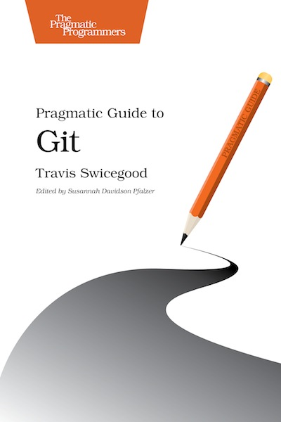

!SLIDE
http://git-scm.com

!SLIDE center
## Pragmatic Guide to Git
### http://pragprog.com/book/pg_git/pragmatic-guide-to-git

!SLIDE center
## Pro Git
### http://git-scm.com/book (free)

!SLIDE center
## Pragmatic Version Control Using Git
### http://pragprog.com/book/tsgit/pragmatic-version-control-using-git

!SLIDE center
## Git Cheat Sheets
### http://help.github.com/git-cheat-sheets/

!SLIDE center
## `cheat` gem
###http://cheat.errtheblog.com/

!SLIDE center
## GitHub Help
### http://help.github.com
